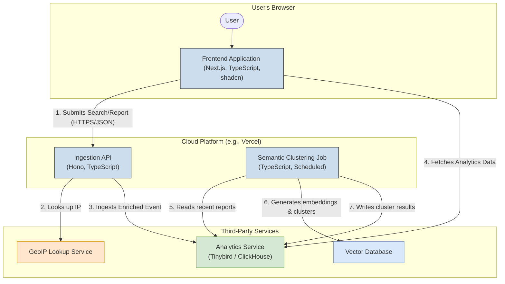
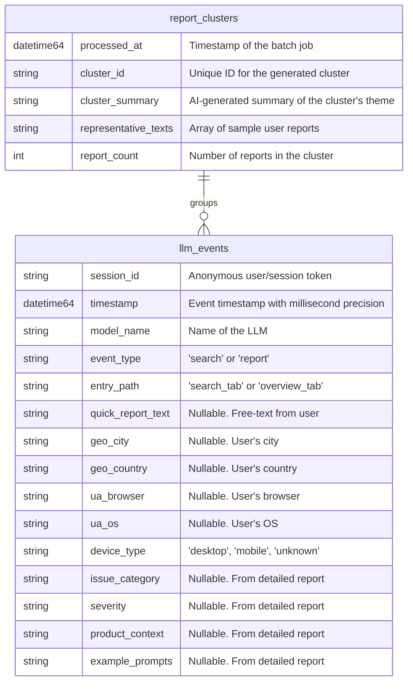
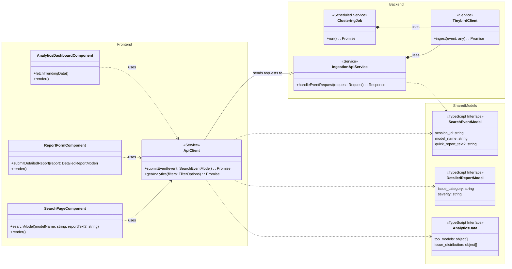

#  Technical Specification
## [TRD-1] System Overview
This document provides the technical blueprint for "Is It Dumb," a web application designed to track and aggregate user-reported issues with Large Language Models (LLMs). The vision is to create a service analogous to "downforeveryoneorjustme.com," but for the real-time, crowd-sourced performance and sentiment of LLMs.

The technical solution consists of three main parts:

The system is designed to be fully anonymous from a user perspective, with no authentication or user accounts.

[TRD-2] A TypeScript-based frontend built with Next.js and styled using the shadcn UI component library, providing an interactive interface for users to report issues and view analytics. 

[TRD-3] A lightweight TypeScript backend API responsible for ingesting user-submitted events, validating data, and securely forwarding it to the analytics platform. 

[TRD-4] An analytics and data backend powered by Tinybird, which uses ClickHouse for real-time data ingestion and querying. This enables the near real-time dashboard functionality. A separate vector database will be used for the semantic analysis of user-submitted text. 

## [TRD-5] Architectural Drivers
### [TRD-6] Goals
[TRD-7] Real-Time Analytics: The primary goal is to provide users with near real-time insights. The dashboard and analytics must update with minimal delay after a report is submitted. $T_{update_delay} < 5s$ for raw counts. 

[TRD-8] Scalability: The system must handle a high volume of concurrent search and reporting events without performance degradation. The data ingestion pipeline must be capable of processing thousands of events per minute. 

[TRD-9] Maintainability & Type Safety: A full TypeScript stack is required for both frontend and backend to ensure type safety, reduce runtime errors, and improve developer experience and long-term maintainability. The DRY principle will be enforced through shared data models. 

[TRD-10] Low-Friction User Experience: The core user flow of searching and submitting a quick report must be extremely fast and simple to encourage high participation. 

### [TRD-11] Constraints
[TRD-12] Frontend Technology: The frontend must be built with TypeScript and use the shadcn UI library. 

[TRD-13] Backend Technology: The backend must be built with TypeScript. 

[TRD-14] Analytics Database: The primary analytics engine must be ClickHouse, managed and exposed via the Tinybird platform. 

[TRD-15] Styling: A specific theme and set of CSS variables provided in the user interview must be implemented for both light and dark modes. 

## [TRD-16] High-Level Architecture
A monolithic repository (

monorepo

) approach is chosen for simplicity and to easily share types between the frontend and backend. The architecture is logically separated into distinct services that can be deployed independently, primarily following a serverless model to optimize for scalability and cost.

### [TRD-17] Architectural Pattern
The system will use a service-based architecture where the frontend application communicates with a dedicated backend API for data ingestion. For data retrieval, the frontend will query Tinybird's published APIs directly, which is a secure and highly performant pattern recommended by Tinybird.

### [TRD-18] Main Components
[TRD-19] Frontend Application (Next.js): A server-side rendered (SSR) React application. It is responsible for all UI rendering, state management, user interaction, and fetching analytics data directly from Tinybird's published API endpoints. 

[TRD-20] Ingestion API (Hono on Cloudflare Workers / Vercel Edge): A lightweight, high-performance TypeScript API service. Its sole responsibilities are to receive search/report events from the frontend, validate the data against strict models, enrich it with server-side information (like GeoIP), and securely push it to the Tinybird Events API. 

[TRD-21] Analytics Service (Tinybird): The core data platform. It ingests event data from the Ingestion API, stores it in ClickHouse, and exposes performant, read-only API endpoints (Pipes) that the frontend consumes to populate the dashboards and charts. 

[TRD-22] Semantic Clustering Service (Scheduled Job): A serverless function that runs on a schedule (e.g., every 15 minutes). It queries recent free-text reports from Tinybird, generates vector embeddings, performs clustering, and writes the results (cluster summaries) back to a dedicated table in ClickHouse. 

[TRD-143] Mock Evaluation Service (Scheduled Job): A serverless function that runs on a schedule to simulate running evaluations against LLM endpoints. It generates mock data points indicating potential quality degradation (e.g., quantization) and writes these results to a dedicated table in ClickHouse for trend analysis. 

### [TRD-23] Components Diagram
[TRD-24]


## [TRD-25] Data Architecture and Models
The data architecture is split between two main systems: Tinybird (ClickHouse) for structured event data and a Vector Database for unstructured text embeddings.

### [TRD-26] Data Storage Strategy
[TRD-27] Tinybird/ClickHouse: Used for all event data. A single, wide, denormalized table is optimal for the analytical query patterns required. This avoids joins and maximizes query speed. Data will be stored with a TTL (Time-To-Live) to manage storage costs and data retention policies. 

[TRD-28] Vector Database: Used exclusively for storing vector embeddings of free-text reports to enable semantic similarity searches for clustering. 

[TRD-29] To maintain a minimal scope and simplify the architecture for this take-home assignment, the decision is to use ClickHouse's native vector search capabilities directly within Tinybird. This avoids the need for an additional external service, co-locates the data, and is sufficient for the project's requirements. 

### [TRD-30] Shared Data Models (TypeScript)
These models will be defined in a shared 

/packages/types

 directory within the monorepo to ensure consistency between the frontend and backend.

[TRD-31]
```typescript
// packages/types/events.ts

/**
 * Geolocation data derived from user's IP address.
 */
export interface Geolocation {
  city?: string;
  region?: string;
  country?: string;
}

/**
 * Details parsed from the User Agent string.
 */
export interface UserAgentDetails {
  browser?: string;
  os?: string;
  device_type: 'desktop' | 'mobile' | 'unknown';
}

/**
 * Base model for all events captured by the system.
 */
export interface EventBase {
  session_id: string; // Anonymous user/session token
  timestamp: string; // ISO 8601 format
  geo_location: Geolocation;
  user_agent_details: UserAgentDetails;
}

/**
 * Model for a search event, which may include a quick report.
 */
export interface SearchEvent extends EventBase {
  event_type: 'search';
  model_name: string;
  entry_path: 'search_tab' | 'overview_tab';
  quick_report_text?: string; // Optional free-text from initial report
}

/**
 * Model for an expanded, detailed report submission.
 * This is treated as an update/enrichment of an initial SearchEvent.
 */
export interface DetailedReport {
  // Corresponds to the session_id and timestamp of the initial event
  session_id: string; 
  original_timestamp: string;

  issue_category: 'hallucination' | 'memory' | 'reliability' | 'ui' | 'other';
  severity: 'low' | 'medium' | 'high';
  product_context: string; // e.g., "Direct API", "Cursor"
  example_prompts?: string;
}
```

### [TRD-32] Entity Relationship Diagram (ClickHouse Schemas)
A denormalized approach is used.

[TRD-33]


## [TRD-34] Component Blueprint & Class Diagram
This diagram illustrates the main services and data transfer objects (DTOs) in the system. While the implementation will use functions and types rather than strict classes, this visualization clarifies responsibilities and data flow.

[TRD-35]


## [TRD-36] User Interface / User Experience Key Requirements
The UI will be clean, data-centric, and highly responsive, built using shadcn components on a Next.js framework.

### [TRD-37] General Look & Feel
[TRD-38] The application must implement the specific light and dark theme provided in the interview, using the OKLCH color values and custom properties in a global CSS file (index.css). 

[TRD-39] Fonts must be configured as specified: "Oxanium" for sans-serif, "Source Code Pro" for mono. 

[TRD-40] The design should be minimalist and modern, prioritizing clarity of data and ease of interaction. 

[TRD-41] All interactive elements must be accessible (WCAG 2.1 AA). 

### [TRD-42] Key Screens / Views
#### [TRD-43] Main Layout
[TRD-44] A persistent header will contain the application title. 

[TRD-45] The main content area will feature a Tabs component (from shadcn) with two tabs: "Search" (default) and "Trending Overview". 

#### [TRD-46] Search Tab
[TRD-47] A prominent Input component for the search bar with the placeholder "Which model are you checking on?". 

[TRD-48] This input must be integrated with an autocomplete/combobox component to suggest common model names as the user types (e.g., GPT-5, Claude 3.5 Sonnet, Gemini 1.5 Pro). 

[TRD-49] Below the search bar, a Textarea for the optional "Quick Report" with a placeholder like "Optional: Briefly describe the issue...". 

[TRD-50] A single Button labeled "Check Model" will trigger the search event submission. 

[TRD-51] After submission, a "Provide More Details" button will appear, which triggers the expansion of the detailed report form. 

#### [TRD-52] Expanded Detailed Report Component
[TRD-53] This component is hidden by default and expands inline without a page refresh when triggered. 

[TRD-54] The component will be a form containing: 

[TRD-55] Select for Issue Category (Hallucination, Memory, etc.). 

[TRD-56] RadioGroup or Select for Severity (Low, Medium, High). 

[TRD-57] Select or RadioGroup for Product Context with a dynamic list of options. Common options will include 'Direct API' and 'Official Web UI', along with pre-populated third-party applications like 'Cursor', 'Windsurf', and 'OpenCode'. If the selected model is from the Anthropic family, 'Claude Code' will be added as an option. An 'Other' option will be included which, when selected, reveals a text input for free-text entry. 

[TRD-58] Textarea for Example Prompts. 

[TRD-59] The form must use inline validation (e.g., highlighting required fields if empty on submit). 

[TRD-60] Any text from the "Quick Report" Textarea will pre-populate a relevant field in this form. 

#### [TRD-61] Trending Overview Tab
[TRD-62] The layout will be a dashboard grid. 

[TRD-63] A filter bar at the top will contain Select components for Time Range (24h, 7d, 30d) and Model Family. 

[TRD-64] Top Reported Models: A BarChart component showing the models with the most reports. Each bar is clickable to navigate to the Model Detail View. 

[TRD-65] Issue Distribution: A PieChart or DonutChart showing the breakdown of issue categories. Each slice is clickable. 

[TRD-66] Recent Trending Issues: A Card component containing a list of auto-generated summaries from the semantic clustering job. Each item shows the summary and a count of related reports. 

[TRD-142] Suspected Quality Degradation: A Card or Table component showing models with recent low scores from the mock evaluation service, indicating potential use of quantized models during peak hours. 

#### [TRD-67] Model Detail View (Dynamic Page)
[TRD-68] Accessed by clicking a model on the overview. 

[TRD-69] Displays the model name as the title. 

[TRD-70] A LineChart showing report volume for this model over the selected time range. 

[TRD-71] A BarChart breaking down issue categories specifically for this model. 

[TRD-72] A scrollable list of anonymized, representative quick_report_text submissions. 

#### [TRD-73] Issue Category Detail View (Dynamic Page)
[TRD-74] Accessed by clicking an issue category slice on the overview. 

[TRD-75] Displays the category name as the title. 

[TRD-76] A LineChart showing the trend of this issue category over time across all models. 

[TRD-77] A BarChart showing which models are most affected by this issue. 

### [TRD-78] Data Models (Frontend Interfaces)
[TRD-79]
```typescript
// types/ui.ts
export interface ChartDataPoint {
  label: string;
  value: number;
}

export interface TimeSeriesDataPoint {
  date: string; // "YYYY-MM-DD"
  count: number;
}

export interface TrendingCluster {
  id: string;
  summary: string;
  reportCount: number;
}

// Prop types for components
export interface BarChartProps {
  data: ChartDataPoint[];
  title: string;
  onBarClick: (label: string) => void;
}
```

### [TRD-80] Styling Plan
[TRD-81] The core styling system is shadcn/ui, which uses Tailwind CSS. 

[TRD-82] The provided theme will be implemented in styles/globals.css by defining CSS variables under :root and .dark selectors as specified. 

[TRD-83] Custom shadcn component registries (@kokonutui, @blocks) will be configured in components.json. 

[TRD-84] Reusable style classes will be managed via Tailwind's @apply directive or by creating custom component variants where necessary. 

[TRD-85] Key UI style classes will be derived from the theme variables, e.g., bg-background, text-foreground, border-border, bg-primary text-primary-foreground. 

### [TRD-86] UI Implementation Plan
The following reusable components will be prioritized for development:

[TRD-87] ModelSearchInput: A composite component including the Input, autocomplete logic, and Textarea for the quick report. 

[TRD-88] DetailedReportForm: The expandable form for detailed issue submission. 

[TRD-89] AnalyticsChart: A wrapper component that can render different chart types (bar, line, pie) using a library like Recharts or Tremor, configured with the app's theme. 

[TRD-90] FilterControls: A component containing the Select inputs for dashboard filtering. 

[TRD-91] DashboardGrid: A responsive grid layout for the Trending Overview page. 

## [TRD-92] Mathematical Specifications and Formulas
While this application does not rely on complex mathematical formulas for its core logic, performance and reliability are defined by quantitative targets.

### [TRD-93] Performance Requirements
[TRD-94] API Response Time (Ingestion): The ingestion API must acknowledge requests within a specified timeframe. $T_{ingestion_p95} < 100ms$. 

[TRD-95] Analytics Query Time (Tinybird): All Tinybird API endpoints powering the dashboard must meet performance criteria. $T_{query_p95} < 250ms$. 

[TRD-96] Frontend Page Load (LCP): The Largest Contentful Paint for the main dashboard should be under the recommended threshold. $T_{LCP} < 2.5s$. 

### [TRD-97] Data Processing
[TRD-98] Semantic Clustering Update Frequency: The batch job for semantic clustering will run at a regular interval, $f_{cluster} = 4$ times per hour (every 15 minutes). 

## [TRD-99] DEVOPS Requirements
### [TRD-100] Deployment
[TRD-101] Frontend and Ingestion API: The entire Next.js application, including the API routes for ingestion, will be deployed to Vercel. This provides a serverless, scalable, and cost-effective hosting solution with integrated CI/CD from a Git repository. 

[TRD-102] Scheduled Clustering Job: Vercel Cron Jobs will be used to trigger the semantic clustering serverless function on its defined schedule. 

[TRD-103] Infrastructure as Code: Tinybird configurations (data sources, pipes) will be managed using their files-based workflow, allowing them to be version-controlled in the Git repository. 

### [TRD-104] Configuration
[TRD-105] All external service credentials and environment-specific settings will be managed using environment variables. 

[TRD-106] Required Variables: 

[TRD-107] TINYBIRD_API_TOKEN (write-scoped, for ingestion) 

[TRD-108] TINYBIRD_READ_TOKEN (read-scoped for specific endpoints, public) 

[TRD-109] GEOIP_SERVICE_API_KEY 

[TRD-110] VECTOR_DB_API_KEY 

[TRD-111] EMBEDDING_MODEL_ENDPOINT 

### [TRD-112] Monitoring
[TRD-113] Application Monitoring: Vercel Analytics will be used for frontend performance monitoring. For error tracking and logging on both the frontend and backend, Sentry will be integrated. 

[TRD-114] Data & API Monitoring: Tinybird provides built-in monitoring dashboards for data ingestion rates, query performance, and API endpoint health. Alerts can be configured within the Tinybird UI. 

## [TRD-115] Implementation, Validation and Verification Strategy
The project will follow a Risk-First Implementation strategy, prioritizing the validation of key technical dependencies and assumptions early in the development cycle.

### [TRD-116] Core Principles
[TRD-117] Iterative Development: Build and validate one user flow at a time, starting with the core "search and quick report" flow. 

[TRD-118] Automated Testing: A comprehensive testing suite is required, including: 

[TRD-119] Unit Tests (Vitest): For individual functions and UI components in isolation. 

[TRD-120] Integration Tests: To test the connection between the Ingestion API and Tinybird. 

[TRD-121] End-to-End Tests (Playwright): For critical user flows like submitting a report and viewing the dashboard. 

### [TRD-122] Integration Risk De-risking
[TRD-123] Tinybird Pipeline (Highest Risk): 

[TRD-124] Risk: Latency in the ingestion-to-query pipeline could violate the "near real-time" requirement. 

[TRD-125] De-risking Step: In Sprint 1, build a proof-of-concept (PoC) consisting of a simple script that sends events to a Tinybird data source and a Tinybird Pipe that reads from it. Measure the end-to-end latency to validate feasibility. 

[TRD-126] Semantic Clustering Viability: 

[TRD-127] Risk: The quality of dynamic clustering may be poor, or the process may be too slow/expensive. 

[TRD-128] De-risking Step: Create a standalone script that fetches 100 sample user reports, generates embeddings using a candidate model (e.g., from Hugging Face), and uses a clustering algorithm (e.g., K-Means or HDBSCAN) to group them. Manually review the clusters for coherence. 

[TRD-129] To minimize implementation complexity and avoid managing infrastructure, the decision is to use the OpenAI Embeddings API. This provides a simple, high-quality solution for generating vector embeddings via a third-party API, which is ideal for the scope of a take-home assignment. 

[TRD-130] GeoIP Service Accuracy & Limits: 

[TRD-131] Risk: The chosen GeoIP service may have restrictive rate limits or provide inaccurate data. 

[TRD-132] De-risking Step: Write a test script to send a batch of diverse IP addresses to the candidate service and verify the accuracy of the location data against known ground truths. 

[TRD-133] For simplicity and cost-effectiveness within the scope of a take-home assignment, the decision is to use the ip-api.com service. Its generous free tier and simple API integration make it a suitable choice for development and demonstration purposes. 

### [TRD-134] TODOs from PRD
[TRD-135] Product Context Capture: 

[TRD-136] The 'product context' will be captured exclusively within the Expanded Detailed Report form. This decision aligns with the primary goal of maintaining a low-friction initial reporting experience for the user. 

[TRD-137] System Availability: 

[TRD-138] The target for system availability is 99.9%. This is considered achievable given the serverless architecture on Vercel and the uptime guarantees provided by Tinybird. 

[TRD-139] Moderation/Anti-spam: 

[TRD-140] To provide a basic level of protection against spam while keeping the scope minimal, the Ingestion API will implement IP-based rate limiting (e.g., 10 requests per minute per IP). This serves as a simple first line of defense. 

[TRD-141] Compliance & Success Metrics: These are business-level decisions and will be implemented once defined. The architecture will not preclude any options. 
